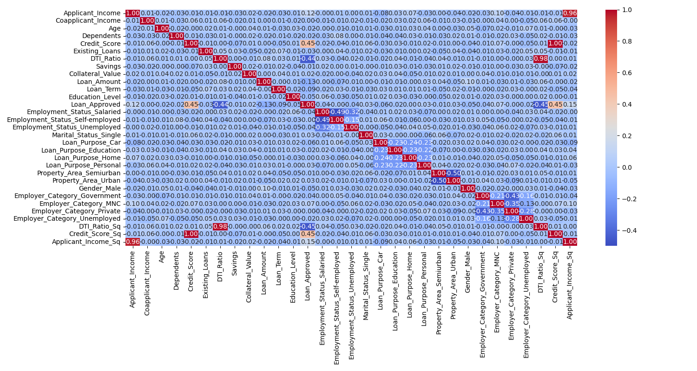

# Loan Approval Prediction

Machine Learning project that predicts whether a loan application is approved or rejected using supervised classification.

---

## Problem Statement

Financial institutions receive thousands of loan applications.

Approving risky applicants causes losses, while rejecting good applicants affects customer satisfaction.

The goal was to predict loan approval using applicant information.

---

## Dataset

Dataset contains applicant information like

- Income
- Credit Score
- DTI Ratio
- Education
- Employment
- Property Area
- Marital Status

Target:

Loan Approved (Yes / No)

---

## Workflow

Data Cleaning

↓

EDA

↓

Feature Engineering

↓

Encoding

↓

Model Training

↓

Evaluation

---

## Exploratory Data Analysis

### Loan Approval Distribution

### Loan Approval by Education Level

### Correlation Heatmap

### Box Plots

---

## Models Used

- Logistic Regression
- Gaussian Naive Bayes
- KNN

---

## Feature Engineering

Squared

- Credit Score
- DTI Ratio

Improved Logistic Regression

F1

0.777 → 0.790

Accuracy

86% → 87%

---

## Results

| Model | Precision | Recall | F1 | Accuracy |
|--------|----------|--------|----|----------|
| Logistic Regression |0.78|0.80|0.79|87%|
| Naive Bayes|0.80|0.74|0.77|86.5%|
|KNN|0.82|0.30|0.43|76.5%|

---

## Business Insight

Since false positives are expensive in lending,

precision was prioritized over overall accuracy.

---

## Technologies

Python

Pandas

NumPy

Scikit-Learn

Matplotlib

Seaborn

---

## Future Improvements

- Hyperparameter tuning
- Cross Validation
- Random Forest
- XGBoost
- Deployment using Streamlit
